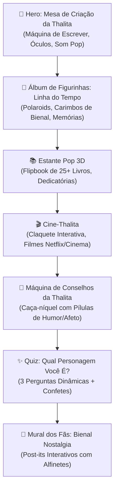

# Especificação: Wireframes e Fluxos de Interação (.agents/specs/wireframes_and_interaction_flows.md)

Este documento detalha o mapa de navegação visual, a estrutura de telas e o comportamento detalhado de cada componente interativo do site biográfico de Thalita Rebouças.

---

## 1. Fluxo do Usuário (User Journey)

---

## 2. Detalhamento Seção por Seção

### Seção 1: Hero — "O Ateliê Carioca da Autora"
- **Visual**: Fundo em tons suaves de papel pautado e sol de Ipanema (#FFD13B suave), com uma mesa ilustrada em perspectiva.
- **Interações**:
  - **Máquina de Escrever**: Cada clique em uma tecla emite som tátil e digita uma letra em uma folha que vai subindo com a frase: *"Escrevo para aproximar as pessoas através do afeto e da risada."*
  - **Óculos Marcantes**: Ao passar o cursor ou tocar, alterna entre 4 cores clássicas das armações da Thalita (Rosa Choque, Amarelo Neon, Roxo Elétrico e Turquesa).
  - **Controle de Áudio Flutuante (Sound Pill)**: No canto superior direito, botão com ondas sonoras que pulsam no ritmo da música instrumental.

### Seção 2: Álbum de Memórias — "A Linha do Tempo em Figurinhas"
- **Comportamento de Scroll**: No desktop, a rolagem vertical do mouse aciona um deslizamento horizontal contínuo com efeito de parallax suave (GSAP ScrollTrigger). No mobile, transforma-se em um carrossel vertical com snapping magnético.
- **Módulos de Memória**:
  - *1974*: Certidão ilustrada e foto de infância no Rio.
  - *2000*: Carta de recusa da 20ª editora transformada em aviãozinho de papel interativo.
  - *2003*: O nascimento de *Fala Sério, Mãe!*, com capa que treme e solta corações ao clique.
  - *2010*: O recorde da Bienal — o usuário arrasta o mouse para "esticar" a fila de autógrafos.
  - *2021*: Conquista do Top 1 global na Netflix com *Confissões de uma Garota Excluída*.

### Seção 3: "A Estante Pop Tridimensional"
- **Visual**: Uma prateleira moderna em madeira clara com iluminação neon.
- **Filtros Interativos**: Botões estilo pílula ("Série Fala Sério", "Trilogia Popstar", "Confissões", "Livros Infantis").
- **Mecânica do Livro**:
  - Ao clicar em um livro, ele se destaca suavemente da estante e se abre no centro da tela.
  - A página esquerda mostra a capa original e estatísticas (ano, editora, páginas, traduções).
  - A página direita mostra o resumo afetuoso, uma curiosidade inédita contada pela Thalita e um botão *"Ler 1º Capítulo"*.
  - Fechar via tecla `ESC` ou botão com animação de fechamento de capa.

### Seção 4: "Cine-Thalita (Do Papel para as Telas)"
- **Visual**: Mini sala de cinema retrô estilizada.
- **Mecânica da Claquete**:
  - O usuário puxa a haste da claquete com o mouse ou toque. Ao soltar, a claquete bate com som de *CLACK!*.
  - O projetor liga iluminando o filme selecionado:
    1. *Fala Sério, Mãe!* (Ingrid Guimarães & Larissa Manoela)
    2. *Tudo por um Popstar* (Maisa, Klara Castanho, Mel Maia)
    3. *Ela Disse, Ele Disse* (Maisa, Bianca Andrade, Duda Matte)
    4. *Confissões de uma Garota Excluída* (Klara Castanho)
    5. *Um Ano Inesquecível: Verão* (Livia Silva)
  - Botão para assistir ao trailer oficial e galeria de fotos de bastidores.

### Seção 5: "Máquina de Conselhos da Thalita"
- **Visual**: Máquina vintage de chicletes ou caça-níquel colorido.
- **Interação**:
  - O usuário clica no botão *"Puxar Alavanca"*.
  - Os cilindros giram com efeito de borrão sonoro e param em uma combinação alegre.
  - Uma cápsula dourada se abre revelando um conselho de sobrevivência amorosa ou amizade direto dos livros, assinado digitalmente por Thalita Rebouças.
  - Botão *"Salvar Card"* gera automaticamente uma imagem pronta para postar nos stories do Instagram.

### Seção 6: "Quiz: Qual Personagem Você É?"
- **Visual**: Cartões em formato de bilhete escolar com animações suaves de transição.
- **Lógica**: 3 perguntas objetivas ("Como você reage a uma fofoca?", "Qual é o seu programa perfeito de fim de semana?", "Como você lida com sua mãe?").
- **Finalização**: Revela o personagem acompanhado de uma chuva de confetes (`canvas-confetti`) e um distintivo digital colecionável.

### Seção 7: "Mural dos Fãs & Bienal Nostalgia"
- **Visual**: Parede de cortiça estilizada com dezenas de recados coloridos.
- **Interação**:
  - O usuário digita seu nome, cidade e uma mensagem de carinho.
  - Escolhe a cor do papel (Rosa, Amarelo, Azul, Verde) e o alfinete.
  - Ao clicar em *"Pregar no Mural"*, o post-it surge animado com som de fixação e balança levemente com física de pêndulo.
